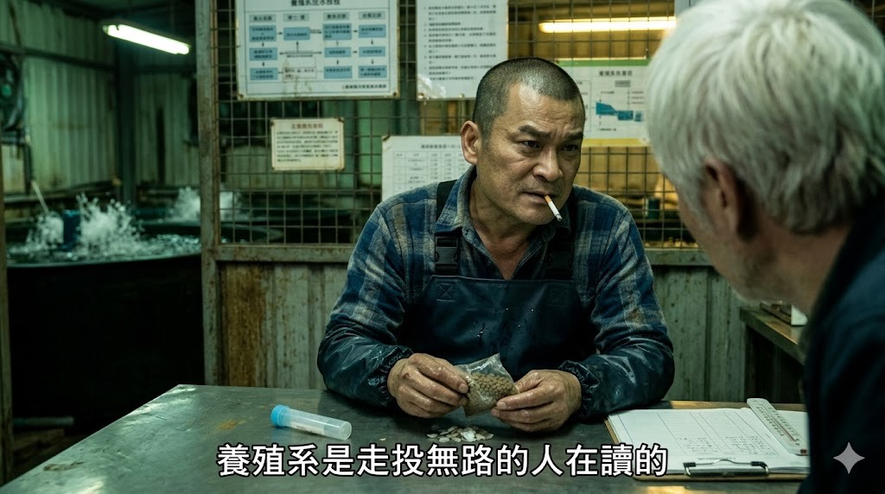

# Water_Quality_Modeling_Tools
水產養殖是走投無路的人在讀的



## Project Overview

River Pulse Station is a browser-based environmental monitoring dashboard designed for community-based water quality observation. The system helps users record field measurements, estimate key indicators in real time, and accumulate structured data for future machine learning and decision support workflows.

This project was developed as a practical demonstration of low-cost water monitoring and local sustainability data collection, combining scientific estimation methods with participatory data collection.

## Why This Project Matters

Many water monitoring programs still depend on expensive lab instruments or centralized field teams. This project demonstrates a more accessible approach:

- low-cost environmental sensing and manual inputs
- fast on-site risk assessment
- shared community data accumulation
- AI-ready dataset preparation for future model training
- support for sustainable resource and environmental governance

## Key Features

- Water quality parameter entry for pH, EC, TDS, SALT, ORP, TEMP, NH, NO3, NO2, GH, KH, and Cl
- Weather parameter support including air pressure, temperature, humidity, and UV
- Location and timestamp recording using latitude/longitude and observation time
- Real-time estimation of:
  - dissolved oxygen saturation
  - un-ionized ammonia risk
  - eutrophication index
- Optional colorimetric conversion workflow using NH4Cl standard absorbance calibration
- Shared observation dataset with search, filtering, deletion, and CSV export
- Personal profile support with pinned location, last-record summary, points, and badges
- Bilingual interface: Traditional Chinese and English

## Project File

- [Water_Quality_Modeling_Tools_web.html](Water_Quality_Modeling_Tools_web.html) — main front-end application
- [README.md](README.md) — project documentation

## Demo Snapshot

The application is structured as a single-page dashboard with four major areas:

1. Fixed station summary and personal profile
2. Observation form for field data collection
3. Real-time assessment panel with gauges and recommendations
4. Historical data table for community dataset review

This design makes it easy for users to:

- enter data quickly on site
- understand immediate water risk status
- compare results across time and locations
- store records for future AI modeling

## Quick Start

Since this is a static front-end application, you can run it directly in a browser.

### Option 1: Open directly

Open [Water_Quality_Modeling_Tools_web.html](https://water-quality-modeling-tools.vercel.app/Water_Quality_Modeling_Tools_web.html) in any modern browser.

### Option 2: Run via local web server

```bash
python -m http.server 8000
```

Then open:

```text
http://localhost:8000/Water_Quality_Modeling_Tools_web.html
```

> If geolocation is needed, allow location access in the browser.

## Usage Workflow

### 1. Enter observation data

Users can capture:

- location coordinates
- observation timestamp
- water quality indicators
- weather conditions

### 2. Use colorimetric conversion (optional)

If absorbance values are available for standard NH4Cl calibration samples, the interface can automatically estimate the ammonia concentration using a linear regression model and populate the NH field.

### 3. Review real-time assessment

The dashboard calculates and visualizes:

- dissolved oxygen status
- ammonia risk level
- eutrophication index
- management guidance

### 4. Save and share records

Each record can be stored in either:

- local browser storage for single-device testing
- shared dataset storage when supported by the runtime environment

## Data Storage Modes

### Local Mode

When opened directly in a standard browser, the app uses browser `localStorage`.

Characteristics:

- data stays only in the current browser
- not shared across devices
- can be cleared by browser data removal

### Shared Mode

In supported environments, the app can write to a shared dataset so multiple users can contribute to the same observation database.

This is useful for participatory monitoring and for building a larger training dataset for future AI modeling.

## Assessment Logic

The web app provides a formula-based screening layer rather than a final laboratory-grade diagnosis. It estimates the following:

- Dissolved oxygen correction based on temperature, atmospheric pressure, and salinity
- Ammonia risk from pH and water temperature using un-ionized ammonia approximations
- Eutrophication index combining EC, NO3, NO2, and pH-related signals

These formulas are intentionally designed for rapid field decision support and educational prototyping.

## Project Showcase and Impact

This project is a strong example of a practical sustainability and environmental technology prototype:

- supports community-based monitoring with low equipment barriers
- makes environmental risk easier to interpret for non-experts
- encourages citizen science participation
- creates reusable structured datasets for future AI and analytics work
- demonstrates how simple web interfaces can scale environmental observation efforts

### Example use cases

- aquaculture pond monitoring
- river and stream health screening
- community water quality surveys
- environmental education and outreach
- early warning data collection for water management teams

## Future Roadmap

The current application is designed as a strong prototype and can be extended in the following directions:

- integrate real weather APIs
- add map visualization for sampling locations
- connect to a backend database and authentication layer
- improve validation and data quality checks
- train a machine learning model using real spectrophotometer ground-truth data
- support multi-user reporting dashboards and analytics views

## Project Status

This project is currently an interactive prototype and demonstration interface for environmental monitoring and AI-ready data collection.

## License

This project is intended for research, education, and sustainability-oriented demonstration use. Please confirm licensing requirements before using it in commercial or public deployment contexts.

---

## Acknowledgment

This project reflects a combined effort toward community-based water monitoring, low-cost environmental sensing, and AI-supported sustainable decision making.

It is positioned as a prototype platform for environmental stewardship and future data-driven ecological intelligence.
